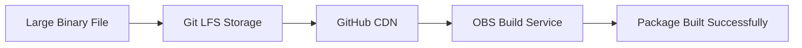

# 📦 OBS Files Repository

<div align="center">


**A dedicated repository for hosting large binary files and assets for Open Build Service (OBS) packages using Git LFS**

[📥 Download Files](#-tracked-files) • [🚀 Quick Start](#-quick-setup) • [📖 Documentation](#-obs-integration) • [❓ FAQ](#-faq)

</div>

---

## 📋 Table of Contents

- [Overview](#-overview)
- [Why This Repository?](#-why-this-repository)
- [Tracked Files](#-tracked-files)
- [Quick Setup](#-quick-setup)
- [Adding New Files](#-adding-new-files)
- [OBS Integration](#-obs-integration)
- [File Management](#-file-management)
- [Troubleshooting](#-troubleshooting)
- [FAQ](#-faq)
- [Contributing](#-contributing)
- [License](#-license)

---

## 🎯 Overview

This repository serves as a **centralized storage solution** for large binary files that are used in Open Build Service (OBS) packages but **cannot be automatically fetched** by OBS SCM services (`obs_scm` or `tar_scm`).

### Key Features

- ✅ **Git LFS Integration** - Efficient storage for large files
- ✅ **Direct OBS Compatibility** - URL-based source downloads
- ✅ **Version Control** - Track changes to binary assets
- ✅ **Bandwidth Optimization** - Pointer files in Git history
- ✅ **Easy Management** - Simple CLI workflow

---

## 💡 Why This Repository?

### Common Scenarios

| Problem | Solution |
|---------|----------|
| 🚫 No public source URL available | ✅ Host in this LFS repo |
| 🚫 Source behind authentication | ✅ Upload here for public access |
| 🚫 Unstable upstream URLs | ✅ Permanent GitHub LFS hosting |
| 🚫 OBS SCM service limitations | ✅ Direct raw file URLs |
| 🚫 Large binary assets (>100MB) | ✅ Git LFS optimized storage |

### Benefits



---

## 📦 Tracked Files

This repository currently hosts the following files:

| File | Size | Type | Added | Description |
|------|------|------|-------|-------------|
| `ayugram-v5.16.4.tar.gz` | TBD | Archive | YYYY-MM-DD | Ayugram Desktop source archive |
| *Add more files...* | - | - | - | - |

### Quick File Access

```bash
# List all tracked LFS files
git lfs ls-files

# Get file information
git lfs ls-files --size
```

---

## 🚀 Quick Setup

### 1️⃣ Prerequisites

Before cloning this repository, ensure Git LFS is installed:

<details>
<summary><b>🐧 Linux</b></summary>

```bash
# Debian/Ubuntu
sudo apt install git-lfs

# Fedora/RHEL
sudo dnf install git-lfs

# Arch Linux
sudo pacman -S git-lfs

# openSUSE
sudo zypper install git-lfs
```
</details>

<details>
<summary><b>🍎 macOS</b></summary>

```bash
# Using Homebrew
brew install git-lfs
```
</details>

<details>
<summary><b>🪟 Windows</b></summary>

Download from [git-lfs.github.com](https://git-lfs.github.com/) or use:

```powershell
# Using Chocolatey
choco install git-lfs

# Using Scoop
scoop install git-lfs
```
</details>

### 2️⃣ Installation

```bash
# Initialize Git LFS for your user account (one-time setup)
git lfs install

# Clone this repository
git clone https://github.com/your-username/obs-files.git
cd obs-files

# Verify LFS is working
git lfs env
```

### 3️⃣ Verify Setup

```bash
# Check that files are actual binaries, not pointers
file ayugram-v5.16.4.tar.gz

# Should output something like:
# ayugram-v5.16.4.tar.gz: gzip compressed data...

# If it says "ASCII text", run:
git lfs pull
```

---

## 📁 Adding New Files

### Method 1: Track Individual Files

```bash
# 1. Add file to repository
cp /path/to/your/large-file.tar.gz .

# 2. Track with LFS
git lfs track "large-file.tar.gz"

# 3. Commit changes (this updates .gitattributes)
git add .gitattributes large-file.tar.gz
git commit -m "feat: add large-file.tar.gz for OBS package X"

# 4. Push to GitHub
git push origin main
```

### Method 2: Track by Extension

```bash
# Track all files of specific types
git lfs track "*.tar.gz"
git lfs track "*.tar.xz"
git lfs track "*.zip"
git lfs track "*.jar"
git lfs track "*.AppImage"
git lfs track "*.deb"
git lfs track "*.rpm"

# Commit the .gitattributes changes
git add .gitattributes
git commit -m "chore: configure LFS tracking for common archive formats"
git push origin main
```

### Method 3: Track by Pattern

```bash
# Track files matching specific patterns
git lfs track "vendor-*.tar.gz"
git lfs track "sources/**/*.zip"
git lfs track "releases/*"
```

### ⚠️ Important Notes

> **Before adding files:**
> - ✅ Verify you have permission to redistribute the file
> - ✅ Check the file size against GitHub LFS limits
> - ✅ Document the file in this README
> - ✅ Include version information in filename
> - ✅ Consider using checksums for verification

---

## 🛠 OBS Integration

### Using Files in OBS Projects

There are **three methods** to reference LFS-hosted files in your OBS spec files:

#### Method 1: Direct Raw URL (Recommended)

```spec
Name:           ayugram-desktop
Version:        5.16.4
Release:        1%{?dist}
Summary:        Ayugram Desktop Telegram client

Source0:        https://raw.githubusercontent.com/your-username/obs-files/main/ayugram-v%{version}.tar.gz

%prep
%autosetup -n ayugram-v%{version}

%build
# Build commands...
```

#### Method 2: LFS Media URL (Better for Large Files)

```spec
# This URL goes directly to the LFS object store
Source0: https://media.githubusercontent.com/media/your-username/obs-files/main/ayugram-v5.16.4.tar.gz
```

**Comparison:**

| Method | Pros | Cons |
|--------|------|------|
| `raw.githubusercontent.com` | ✅ Simple URL<br>✅ Works with LFS | ⚠️ May redirect for large files |
| `media.githubusercontent.com` | ✅ Direct LFS access<br>✅ Better for files >100MB | ⚠️ Longer URL |

#### Method 3: GitHub Releases (Alternative)

For better organization, use GitHub Releases:

```bash
# Create a release and attach files
gh release create v1.0.0 ayugram-v5.16.4.tar.gz --title "Release v1.0.0"
```

Then in your spec file:
```spec
Source0: https://github.com/your-username/obs-files/releases/download/v1.0.0/ayugram-v5.16.4.tar.gz
```

### Complete OBS Example

<details>
<summary><b>View complete .spec file example</b></summary>

```spec
#
# spec file for package ayugram-desktop
#

Name:           ayugram-desktop
Version:        5.16.4
Release:        1%{?dist}
Summary:        Ayugram Desktop - Enhanced Telegram client
License:        GPL-3.0-or-later
URL:            https://github.com/AyuGram/AyuGramDesktop
Source0:        https://raw.githubusercontent.com/your-username/obs-files/main/ayugram-v%{version}.tar.gz

BuildRequires:  cmake
BuildRequires:  gcc-c++
BuildRequires:  ninja-build

%description
Ayugram Desktop is an enhanced Telegram Desktop client with additional features.

%prep
%autosetup -n ayugram-v%{version}

%build
mkdir build
cd build
cmake .. \
    -GNinja \
    -DCMAKE_BUILD_TYPE=Release
ninja

%install
cd build
%ninja_install

%files
%license LICENSE
%doc README.md
%{_bindir}/ayugram-desktop

%changelog
* Mon Jan 20 2024 Your Name <your@email.com> - 5.16.4-1
- Initial package
- Source hosted via GitHub LFS repository
```
</details>

### OBS Service File Alternative

Create `_service` file in your OBS package:

```xml
<services>
  <service name="download_url">
    <param name="url">https://raw.githubusercontent.com/your-username/obs-files/main/ayugram-v5.16.4.tar.gz</param>
  </service>
</services>
```

---

## 📝 File Management

### Viewing Tracked Files

```bash
# List all LFS files with sizes
git lfs ls-files --size

# Show LFS file details
git lfs ls-files --debug

# View which patterns are tracked
cat .gitattributes
```

### Checking Storage Usage

```bash
# View local LFS cache size
du -sh .git/lfs

# Check remote LFS storage (requires gh CLI)
gh api repos/:owner/:repo/git/lfs/objects
```

### Removing Files

```bash
# Remove file from tracking (but keep in history)
git rm large-file.tar.gz
git commit -m "chore: remove deprecated file"
git push

# Completely remove from history (advanced)
git filter-repo --path large-file.tar.gz --invert-paths
git lfs prune
```

### File Verification

```bash
# Verify LFS file integrity
git lfs fsck

# Get SHA256 hash for verification in OBS
sha256sum ayugram-v5.16.4.tar.gz

# Create checksums file
sha256sum *.tar.gz > checksums.txt
```

---

## 🔧 Troubleshooting

### Issue: Files Show as Text Pointers

**Symptom:**
```bash
$ cat ayugram-v5.16.4.tar.gz
version https://git-lfs.github.com/spec/v1
oid sha256:4d7a214614ab2935c8...
size 123456789
```

**Solution:**
```bash
git lfs install
git lfs pull
```

### Issue: LFS Not Tracking New Files

**Symptom:** File commits but remains small in size

**Solution:**
```bash
# Migrate existing file to LFS
git lfs migrate import --include="filename.tar.gz"

# Or re-add with LFS
git rm --cached filename.tar.gz
git lfs track "filename.tar.gz"
git add filename.tar.gz
git commit -m "fix: migrate filename to LFS"
```

### Issue: Download Fails in OBS

**Symptom:** OBS cannot fetch file from GitHub

**Solutions:**

1. **Check URL accessibility:**
```bash
curl -I "https://raw.githubusercontent.com/user/repo/main/file.tar.gz"
```

2. **Use LFS media URL instead:**
```spec
Source0: https://media.githubusercontent.com/media/user/repo/main/file.tar.gz
```

3. **Verify file is pushed:**
```bash
git lfs ls-files
```

### Issue: Storage Quota Exceeded

**GitHub LFS Limits:**
- Free: 1GB storage, 1GB/month bandwidth
- Pro: 50GB storage, 50GB/month bandwidth

**Solutions:**

1. **Prune old files:**
```bash
git lfs prune
```

2. **Use Git LFS with alternative storage:**
```bash
# Configure custom LFS server
git config lfs.url "https://your-lfs-server.com"
```

3. **Upgrade GitHub plan** or use GitHub Releases

### Issue: Clone is Slow

**Solution:** Clone without LFS, then fetch specific files:

```bash
# Clone without LFS files
GIT_LFS_SKIP_SMUDGE=1 git clone https://github.com/user/obs-files.git

# Fetch only specific files
cd obs-files
git lfs pull --include="ayugram-v5.16.4.tar.gz"
```

---

## ❓ FAQ

<details>
<summary><b>Q: Why not use GitHub Releases instead?</b></summary>

**A:** Both approaches work! This repository offers:
- Version control for binaries
- Pattern-based tracking
- Easier automation with `git lfs`

GitHub Releases are better for:
- User-facing downloads
- Semantic versioning
- Release notes
</details>

<details>
<summary><b>Q: What's the maximum file size?</b></summary>

**A:** 
- Single file: **2GB** (GitHub's hard limit)
- Total storage: Depends on your plan (1GB free, 50GB Pro)
- For files >2GB, use external hosting (S3, CDN, etc.)
</details>

<details>
<summary><b>Q: Can I use this for proprietary software?</b></summary>

**A:** Only if you have **legal permission** to redistribute. Always:
1. Check the original license
2. Verify redistribution rights
3. Document sources and licenses
4. Include license files
</details>

<details>
<summary><b>Q: How do I automate file uploads?</b></summary>

**A:** Use GitHub Actions:

```yaml
name: Upload to LFS
on:
  workflow_dispatch:
    inputs:
      file_url:
        description: 'URL to download'
        required: true

jobs:
  upload:
    runs-on: ubuntu-latest
    steps:
      - uses: actions/checkout@v3
      - name: Install LFS
        run: git lfs install
      - name: Download file
        run: curl -L -o file.tar.gz ${{ github.event.inputs.file_url }}
      - name: Add to LFS
        run: |
          git lfs track "*.tar.gz"
          git add .gitattributes file.tar.gz
          git commit -m "chore: add file.tar.gz"
          git push
```
</details>

<details>
<summary><b>Q: How to verify file integrity in OBS?</b></summary>

**A:** Add checksums to your spec file:

```spec
Source0: https://raw.githubusercontent.com/user/obs-files/main/file.tar.gz
Source1: https://raw.githubusercontent.com/user/obs-files/main/checksums.txt

%prep
sha256sum -c %{SOURCE1}
%autosetup
```
</details>

---

## 🤝 Contributing

### Adding New Files

1. **Fork this repository**
2. **Create a feature branch**
   ```bash
   git checkout -b add-new-package
   ```
3. **Add your file with LFS**
   ```bash
   git lfs track "your-file.tar.gz"
   git add .gitattributes your-file.tar.gz
   ```
4. **Update this README** (add to the table above)
5. **Commit and push**
   ```bash
   git commit -m "feat: add your-package-v1.0.0.tar.gz"
   git push origin add-new-package
   ```
6. **Create a Pull Request**

### Contribution Guidelines

- ✅ Use semantic file names: `package-vX.Y.Z.tar.gz`
- ✅ Include checksums when possible
- ✅ Document the file purpose
- ✅ Verify redistribution rights
- ✅ Keep files organized (use subdirectories if needed)
- ❌ Don't commit without LFS tracking
- ❌ Don't include personal/sensitive data

---

## 📊 Repository Statistics

```bash
# View storage usage
git lfs ls-files --size | awk '{s+=$2} END {print "Total LFS storage:", s/1024/1024, "MB"}'

# Count tracked files
git lfs ls-files | wc -l

# View largest files
git lfs ls-files --size | sort -k2 -n -r | head -10
```

---

## 📄 License & Legal

### Repository License

This repository infrastructure is provided under the **MIT License** (see [LICENSE](LICENSE) file).

### Individual File Licenses

**Important:** Each hosted file is subject to **its own original license**. This repository does NOT claim ownership or relicense any content.

| File | Original License | Source |
|------|------------------|--------|
| `ayugram-v5.16.4.tar.gz` | GPL-3.0-or-later | [AyuGram/AyuGramDesktop](https://github.com/AyuGram/AyuGramDesktop) |
| *Add entries...* | - | - |

### Takedown Requests

If you are a copyright holder and believe content should be removed:
1. Open an issue with "DMCA" in the title
2. Email: `itachi_re@protonmail.com`
3. We will respond within 48 hours

---

## 🔗 Related Resources

- [Git LFS Documentation](https://git-lfs.github.com/)
- [Open Build Service Documentation](https://openbuildservice.org/help/manuals/obs-user-guide/)
- [OBS Source Services](https://en.opensuse.org/openSUSE:Build_Service_Concept_SourceService)
- [GitHub LFS Billing](https://docs.github.com/en/billing/managing-billing-for-git-large-file-storage)

---

## 📞 Support

- **Issues:** [GitHub Issues](https://github.com/your-username/obs-files/issues)
- **Discussions:** [GitHub Discussions](https://github.com/your-username/obs-files/discussions)
- **Email:** `itachi_re@protonmail.com`

---

<div align="center">

**[⬆ Back to Top](#-obs-files-repository)**

Made with ❤️ for the Open Build Service community


</div>

---
